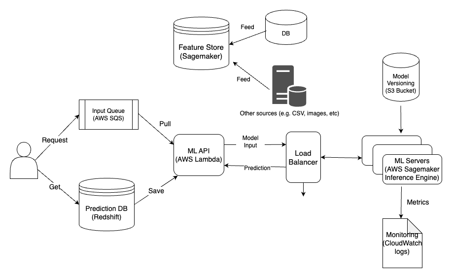

# Offline Inferencing Architecture

In this example, we are going to deploy an offline inference pipeline using AWS as illusterated in the architecture below:



You will need to register a key pair in AWS order to access the instances. You can create a new one
or import an existing one.

## How to Create a Key Pair for AWS:

You can create a key pair using the AWS Management Console, AWS CLI, or SDK. Here is an example using the AWS CLI:

```shell
aws ec2 create-key-pair --key-name my-key-pair --query 'KeyMaterial' --output text > my-key-pair.pem
chmod 400 my-key-pair.pem

```

In this example:

    `my-key-pair` is the name of the key pair.
    `my-key-pair.pem` is the private key file that will be downloaded and used to access the instance.

## How to Import Your Existing SSH Key with AWS

If you already have an SSH key pair (`~/.ssh/id_rsa` and `~/.ssh/id_rsa.pub`), you can import the public key into AWS to create a key pair.

Use the AWS CLI to import the key:

```shell
aws ec2 import-key-pair --key-name my-key-pair --public-key-material fileb://~/.ssh/id_rsa.pub

```
`my-key-pair` is the name you want to give the key pair in AWS.
`fileb://~/.ssh/id_rsa.pub` is the local path to your public key file.

<!--
### Reference the Key Pair in Terraform:
Once the key pair is created in AWS, you can reference it by name in your Terraform configuration.
-->

# Sagemaker model endpoint deployment through terraform

## Step 0: AWS profile setup
Configure aws profile to be used by terraform

```bash
aws configure --profile sagemaker
```

and enter your AWS Access Key ID and Secret Key ID.

## Step 1: Create S3 bucket with version enabled

Create a s3 bucket to store the terraform state. The bucket should have version enabled. Enabling versioning for the S3 bucket storing Terraform state allows maintaining historical versions of the state file, aiding in disaster recovery, change tracking, and collaborative work.

**Create an S3 bucket from the CLI**

```bash
aws s3api create-bucket \
    --bucket sagemaker-endpoint-deploy-tf-state-vector \
    --region us-east-1 \
    --profile sagemaker
```

> [!NOTE]
> Change the name of the bucket in this command, as bucket names are global.

**Enable Versioning**

```bash
aws s3api put-bucket-versioning \
    --bucket sagemaker-endpoint-deploy-tf-state-vector \
    --versioning-configuration Status=Enabled \
    --profile sagemaker
```
> [!NOTE]
> Remember to use the same bucker name you used on the previous command.

## Step 2: Build (compile) and upload model artifacts

### First, let's download the model artifacts:

The [`code`](./aws_sagemaker/code) folder contains the [`inference.py`](./aws_sagemaker/code/inference.py) script, which will be used by the SageMaker model endpoint to generate a model inference from an API call, and the [`requirements.txt`](./aws_sagemaker/code/requirements.txt) which contains the Python dependencies. Copy them to your model directory.

Your model directory structure (and hence the compressed file generated) should look like this:
```
traced_model-ml_inf1.tar.gz/
├── code/
│   └── inference.py
│   └── requirement.txt
└── paraphrase_bert.pt
└── config.json
└── tokenizer.json
└── tokenizer_config.josn
```

The compressed model folder should also contain the model artifacts, like the model config and the model weights. Here, actual model files like `pytorch_model.bin` and `config.json` are absent. You should get it from the following link: [Paraphrase Classification Model with BERT](https://huggingface.co/Prompsit/paraphrase-bert-en/tree/main)

Prepare the model artifacts and upload them to an S3 bucket using the [`upload_model.py`](./aws_sagemaker/upload_model.py) script. It uploads models to SageMaker's default S3 bucket.

Here we have prepared two model artifacts: a normal model and a traced model. The traced model is later used to compile model specifically for AWS Inferentia chips, which are cheaper and faster.

### Now compile for `inf1` machines:

Update any variable required (under `TODO`s) in the [`deploy.py`](./aws_sagemaker/deploy.py) script and run it.

After successful running of `deploy.py`, the S3 URL for compiled model is printed. 

Now, Copy the S3 model artifacts (`.tar.gz` file) link and place it into `sagemaker_model_data_s3_url` in the [`terraform.tfvars`](./terraform.tfvars) file. There's no need to repeat this compilation and upload step in the future unless you delete your `.tar.gz` model file from the S3 bucket or make changes to your model.


### Compress the Lambda function for deployment:

```bash
zip -r lambda.zip ./ml-api/* -j
```

- `zip -r lambda.zip` : It creates a zip file named `lambda.zip`
- `./ml-api/*` : It specifies the path of the files and folders inside the `ml-api` directory. The `*` glob pattern is used to include all files and folders inside the `lambda` directory.
- `-j`: With this option, `zip` will store only the relative paths of the files, effectively flattening the folder structure inside the zip archive.

Remember to repeat this step every time you change anything in your Lambda Functions.


## Step 3: Terraform deploy

> [!NOTE]
>Don't forget to change the variables' values in [`terraform.tfvars`](./terraform.tfvars) file as per your preferences**

```bash
terraform init
```

```bash
terraform plan
```

```bash
terraform apply
```

```bash
terraform destroy
```

1. `terraform init`
    - It initializes a Terraform configuration in the current directory. 
    - It downloads and installs the required provider plugins and modules specified in our configuration. 
    - It sets up the working directory and prepares it for the other Terraform commands.

2. `terraform plan`
    - It creates an execution plan for our infrastructure. 
    - It compares the desired state (specified in our Terraform configuration files) with the current state (tracked in the Terraform state file). 
    - The plan shows what changes Terraform will make to achieve the desired state. 
    - It does not make any actual changes to our infrastructure; it only shows us what changes will occur when we apply.

3. `terraform apply`
    - It applies the changes to our infrastructure as described in the execution plan generated by `terraform plan`. 
    - It creates, updates, or deletes resources as needed to reach the desired state. 
    - It interacts with us to confirm whether we want to proceed with the changes or not, based on the plan.

4. `terraform destroy`
    - It is used to destroy the infrastructure created by Terraform. 
    - It will delete all the resources that were previously created using `terraform apply`. 
    - Terraform will ask for confirmation before actually destroying the resources to avoid accidental deletions.

After successful deployment you will see something like below (if not, you can get your API Gateway URL from AWS console)

```bash
Apply complete! Resources: 16 added, 0 changed, 0 destroyed.
```

## Caution!!!

>[!CAUTION] 
> Remember that `terraform apply` and `terraform destroy` can make changes to our infrastructure, so use them with caution.** 

> [!CAUTION]
> Always carefully review the execution plan produced by `terraform plan` before applying changes to ensure that the impact on your infrastructure is well understood.**

## Feeding the Feature Store

Before using the endpoint that retrieves data from feature store for inference, you have to ingest some data into it. Simply run the [`ingest_data_to_fs.py`](./aws_sagemaker/ingest_data_to_fs.py) script to do so.

## Offline inference
For offline inference, we're going to add two new components:

1. An AWS SQS that users are able to send a batch of requests for prediction to,
2. A Redshift Cluster which hosts a database table for storing predictions for later retrieval by users.

By editing and running the [`publish_to_queue.py`](./aws_sagemaker/publish_to_queue.py) script, you can place a request for an input in feature store in the queue, and the Lambda Function picks up the requests from the queue and sends it to the ML enpoint.

After receiving the response, it writes the results into a `predictions` Redshift database and into the `prediction_results` table. 

```shell
python -m aws_sagemaker.publish_to_queue
```

If you open Redshift console in AWS, you are able to connect to `predictions` database, and query `prediction_results`.
