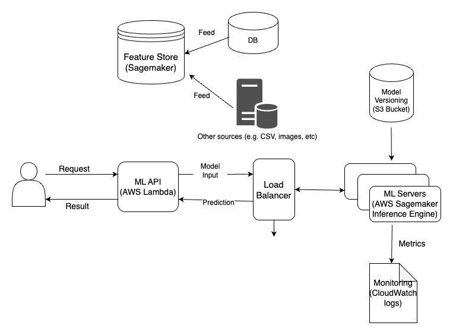

# Online Inferencing Architecture
In this example, we are going to deploy an online inference pipeline using AWS as illusterated in the architecture below:


## How to Create a Key Pair for AWS:

You can create a key pair using the AWS Management Console, AWS CLI, or SDK. Here is an example using the AWS CLI:

```shell
aws ec2 create-key-pair --key-name my-key-pair --query 'KeyMaterial' --output text > my-key-pair.pem
chmod 400 my-key-pair.pem

```

In this example:

    `my-key-pair` is the name of the key pair.
    `my-key-pair.pem` is the private key file that will be downloaded and used to access the instance.

## Steps to Use Your SSH Key with AWS (our approach)

### Create a Key Pair in AWS:
If you already have an SSH key pair (~/.ssh/id_rsa and ~/.ssh/id_rsa.pub), you can import the public key into AWS to create a key pair.

Use the AWS CLI to import the key:

```shell
aws ec2 import-key-pair --key-name my-key-pair --public-key-material fileb://~/.ssh/id_rsa.pub

```
`my-key-pair` is the name you want to give the key pair in AWS.
`fileb://~/.ssh/id_rsa.pub` is the local path to your public key file.

### Reference the Key Pair in Terraform:
Once the key pair is created in AWS, you can reference it by name in your Terraform configuration.

# Sagemaker model endpoint deployment through terraform

## Step 0: AWS profile setup
Configure aws profile to be used by terraform

```bash
aws configure --profile sagemaker
```

and enter aws access key id and secret key id

## Step 1: Create S3 bucket with version enabled

Create a s3 bucket to store the terraform state. The bucket should have version enabled. Enabling versioning for the S3 bucket storing Terraform state allows maintaining historical versions of the state file, aiding in disaster recovery, change tracking, and collaborative work.

**Create s3 bucket from CLI**

```bash
aws s3api create-bucket \
    --bucket sagemaker-endpoint-deploy-tf-state-vector \
    --region us-east-1 \
    --profile sagemaker
```

**Enable Version**

```bash
aws s3api put-bucket-versioning \
    --bucket sagemaker-endpoint-deploy-tf-state-vector \
    --versioning-configuration Status=Enabled \
    --profile sagemaker
```

## Step 2: Build (compile) and upload model artifacts

**First lets download model artifacts**

`code` folder contains `inference.py` which will be used by sagemaker model endpoint to generate model inference from API call and `requirements.txt` for python dependency. Copy them to your model directory. Your model directory structure (and hence the zip file generated) should look like this:
```
traced_model-ml_inf1.tar.gz/
├── code/
│   └── inference.py
│   └── requirement.txt
└── paraphrase_bert.pt
└── config.json
└── tokenizer.json
└── tokenizer_config.josn
```

The model should also contain the model artifacts like model config and actual model. Here actual model files like `pytorch_model.bin` and `config.json` are absent. You should get it from the link here [Paraphrase Classification Model with BERT](https://huggingface.co/Prompsit/paraphrase-bert-en/tree/main)

Prepare model artifacts and upload them to S3 bucket using `upload_model.py`. It uploads models to sagemaker's default S3 bucket.

Here we have prepared two model artifacts: normal model and traced model. Traced model is later used to compile model specifically for AWS Infernetia chips, which are cheaper and faster.

**Now compile for `inf1` machines**

Update any variable required (under `TODO`s) in `deploy.py` and run it.

After successful running of `deploy.py`, the S3 URL for compiled model is printed. 

Now, Copy the s3 model artifacts (`.tar.gz` file) link and place it into `sagemaker_model_data_s3_url` in `terraform.tfvars` file. There's no need to repeat this compilation and upload step in the future unless you delete your tar.gz model from S3 bucket or change your model.


**Compress Lambda function for deployment**

```bash
zip -r lambda.zip ./ml-api/* -j
```
- `zip -r lambda.zip` : It creates a zip file named `lambda.zip`
- `./ml-api/*` : It specify the path of the files and folders inside the `ml-api` directory. The `*` glob pattern is used to include all files and folders inside the `lambda` directory.
- `-j`: With this option, `zip` will store only the relative paths of the files, effectively flattening the folder structure inside the zip archive.

Remember to repeat this step every time you change anything in your Lambda Functions.


## Step 3: Terraform deploy

**Don't forget to change variables name in `terraform.tfvars` file as your preferences**

```bash
terraform init
```

```bash
terraform plan
```

```bash
terraform apply
```

```bash
terraform destroy
```

1. `terraform init`
    - It initializes a Terraform configuration in the current directory. 
    - It downloads and installs the required provider plugins and modules specified in our configuration. 
    - It sets up the working directory and prepares it for the other Terraform commands.

2. `terraform plan`
    - It creates an execution plan for our infrastructure. 
    - It compares the desired state (specified in our Terraform configuration files) with the current state (tracked in the Terraform state file). 
    - The plan shows what changes Terraform will make to achieve the desired state. 
    - It does not make any actual changes to our infrastructure; it only shows us what changes will occur when we apply.

3. `terraform apply`
    - It applies the changes to our infrastructure as described in the execution plan generated by `terraform plan`. 
    - It creates, updates, or deletes resources as needed to reach the desired state. 
    - It interacts with us to confirm whether we want to proceed with the changes or not, based on the plan.

4. `terraform destroy`
    - It is used to destroy the infrastructure created by Terraform. 
    - It will delete all the resources that were previously created using `terraform apply`. 
    - Terraform will ask for confirmation before actually destroying the resources to avoid accidental deletions.

After successful deployment you will see something like below (if not, you can get your API Gateway URL from AWS console)

```bash
Apply complete! Resources: 16 added, 0 changed, 0 destroyed.

Outputs:

api_gateway_url = "https://k3565nbkl6.execute-api.us-east-1.amazonaws.com/dev"
```

Append `/predict` to the api url for getting the sentiment for financial text. Request method will be `POST`.

```bash

https://k3565nbkl6.execute-api.us-east-1.amazonaws.com/dev/predict

Request:

{"seq_0": "The fluffy white cat curled up on the cozy armchair, napping peacefully in the warm sunlight streaming through the window.", "seq_1": "Snuggling comfortably in the sunlit armchair, the soft, white cat dozed off, enjoying a tranquil nap."}

Response:

{
    "data": [
        {
            "label": "POSITIVE",
            "score": 1
        }
    ]
}
```

## Caution!!!
**Remember that `terraform apply` and `terraform destroy` can make changes to our infrastructure, so use them with caution.** 

**Always review the execution plan carefully `terraform plan` before applying changes to ensure that us understand the impact on our infrastructure.**

## Feeding Feature Store
In this step of the AWS model deployment, we are going to add a feature store, and feed it with our data/features, and we can send feature/sequence ID in order to get predictions for already stored items.
Before using the endpoint that retrieves data from feature store for inference, you have to ingest some data into it. Simply run `ingest_data_to_fs.py` to do so.

Then you can send an id to `/prediction/{id}` API endpoint to get the prediction result. 