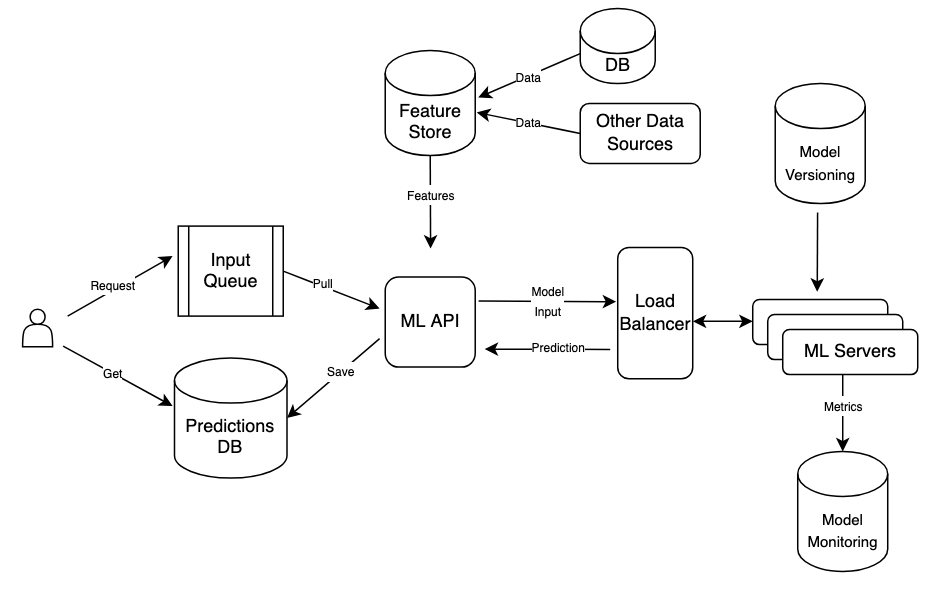

# Offline Inferencing Architecture

This guide will help you set up an offline (batch) inferencing architecture.
At the end of this guide you should have an architecture reflecting the diagram below:



There will be an input queue which will receive a request to make a prediction with a
feature id. The ML API cloud function will be triggered, retrieve that record from the
Feature Store and send it as input to the ML Servers. The servers will make an inference
with the input data and return a prediction. The ML API will in turn save the prediction
into the database for later use.

## Terraform

If this is your first time running this, or if you have made significant changes to
the terraform scripts, you should first initialize terraform:

```shell
terraform init -var-file=../terraform.tfvars
```

To see what are the components being created by terraform, run a plan:
```shell
terraform plan -var-file=../terraform.tfvars
```

Ultimately, trigger the creation of the architecture components by applying the
terraform plan:

```shell
terraform apply -var-file=../terraform.tfvars
```

At the end of the `apply` command, your pipeline should be ready to be tested.

## Feature Store

To add a data point to the SQL database, use the `add_data_point` script:
```shell
python -m add_data_point "test data point 1"
```

To import those data points into the Feature Store, run `import_data_to_fs`:
```shell
python -m import_data_to_fs
```

You will need to wait for a sync operation to complete in order to query the
feature store. The first sync can take a long time (up to 20 minutes), to check
the status of the sync operation, go to the link below, select your feature store,
then select your view. The sync operations will be shown at the bottom of the page.
```text
https://console.cloud.google.com/vertex-ai/feature-store/online-stores
```

After the data has been synced, it will be ready to be pulled for prediction.

## Predict

To publish a message to the prediction queue for a data point, use the `publish.py`
script. The ML API is expecting the message to be a JSON string like the one below:
```shell
python -m publish "{\"id\": \"1\"}"
```

The ML API should be kicked off and a prediction should be added to the database
once it has been processed by the ML Servers. The prediction should be a JSON string
in the format below (for the bart-large-mnli model):
```shell
{
  "data": "test data point 1",
  "prediction": {
    "sequence": "test data point 1",
    "labels": ["mobile","website","account access","billing"],
    "scores": [0.3478688597679138,0.3263603150844574,0.1976030468940735,0.1281677484512329]
  }
}
```

## Destroy

When you are done with your tests, please destroy the architecture to avoid unnecessary
costs:
```shell
terraform destroy -var-file=../terraform.tfvars
```
