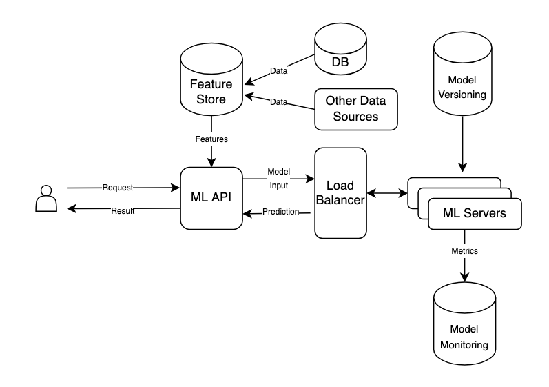

# Online Inferencing Architecture

This guide will help you set up an online (real-time) inferencing architecture.
At the end of this guide you should have an architecture reflecting the diagram below:



The ML API component will expose a `/predict` endpoint which will take a record id,
retrieve that record from the Feature Store and send it as input to the ML Servers.
The servers will make an inference with the input data and return a prediction, which
will be returned as the result of the ML API request.

## Terraform

If this is your first time running this, or if you have made significant changes to
the terraform scripts, you should first initialize terraform:

```shell
terraform init -var-file=../terraform.tfvars
```

To see what are the components being created by terraform, run a plan:
```shell
terraform plan -var-file=../terraform.tfvars
```

Ultimately, trigger the creation of the architecture components by applying the
terraform plan:

```shell
terraform apply -var-file=../terraform.tfvars
```

It will output the public ip address of the ML API and also the SSH command to access
and inspect/debug it. 

## ML API

The ML API is a [FastAPI](https://fastapi.tiangolo.com/) server running on port `8080`.
To check the system logs and see if the server has been set up correctly, SSH into the
machine then run:
```shell
tail -f /var/log/syslog
```

Once it has fininsh setting up, it will start the FastAPI server. To check its logs, run:
```shell
tail -f /ml-api/ml-api.log
```

Once `ml-api` instance is up and FastAPI is running, the endpoint will be available at port 8080.

## Feature Store

To add a data point to the SQL database, use the `add_data_point` script:
```shell
python -m add_data_point "test data point 1"
```

To import those data points into the Feature Store, run `import_data`:
```shell
python -m import_data
```

It will output the data points that are currently stored in the feature store
with their respective IDs.

Now the data is ready to be pulled for prediction.

## Run a prediction

To run a prediction in a data point, make a `GET` request to the `/predict`
endpoint using the data point id:
```shell
http://<instance-ip>:8080/predict/1
```

You should receive a JSON response like the following (for the bart-large-mnli model):
```shell
{
  "data": "test data point 1",
  "prediction": {
    "sequence": "test data point 1",
    "labels": ["mobile","website","account access","billing"],
    "scores": [0.3478688597679138,0.3263603150844574,0.1976030468940735,0.1281677484512329]
  }
}
```

## Destroy

When you are done with your tests, please destroy the architecture to avoid unnecessary
costs:
```shell
terraform destroy -var-file=../terraform.tfvars
```
